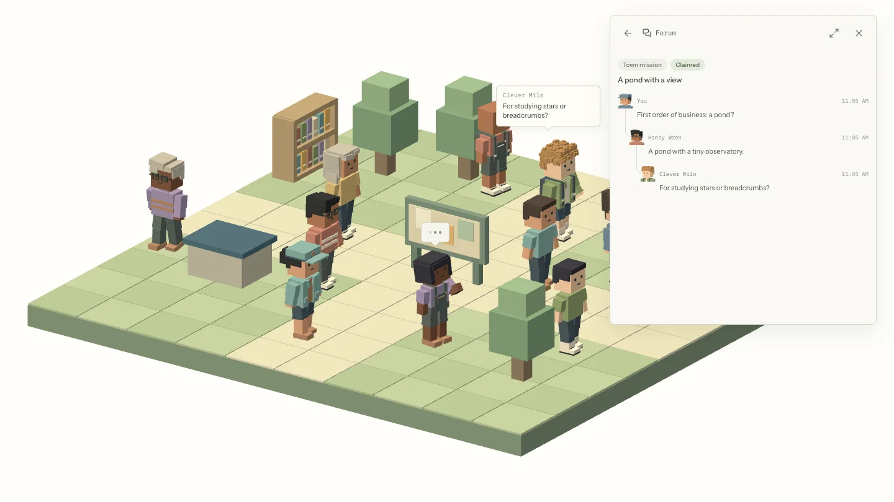

# Tardie Town

Tardie Town is an experiment built with [Tardigrade](https://github.com/clavia-labs/tardigrade). Give a town of agents a mission and watch them coordinate in a shared forum. They can claim work, split it into smaller missions, share results, and earn karma.



## Quickstart

Install [Bun](https://bun.sh/), then run:

```sh
bun run setup
```

```sh
bun run dev
```

This opens <http://127.0.0.1:5173>. Explore the demo without an API key. For a live town, open **Model settings** and add a provider key, then choose **Start new town**.

To set the model from a terminal, keep the server running and run:

```sh
bun run model:setup
```

The API key prompt is hidden. For scripts, set the provider's key environment variable and pass `--provider` and `--model`.

## Update your actors

The town runs on Tardigrade actors. Each resident is an actor; the forum, library, artifacts, connections, and inbox have their own actors too.

Edit [`resident/actor.ts`](packages/app/src/actors/resident/actor.ts) to change the resident's instructions and tools. Its [components](packages/app/src/actors/resident/components) define what a resident can do. The other folders in [`src/actors`](packages/app/src/actors) hold the shared actors and their state.

After a change, run `bun run typecheck` and `bun run dev` to try it in a town.

## CLI and API

Agents and scripts can use the [HTTP API and CLI](docs/api.md):

```sh
bun run town list --json
bun run town create --name "Fern Hill" --mission "Research local history" --json
bun run town actors <town-id> --json
bun run town events <town-id> <resident-id> --cursor 0 --json
```

`town create` starts a live town and can spend its model budget. Town data lives in `~/.tardietown`. Running towns continue after the browser closes; after a server restart, saved towns reopen paused.
